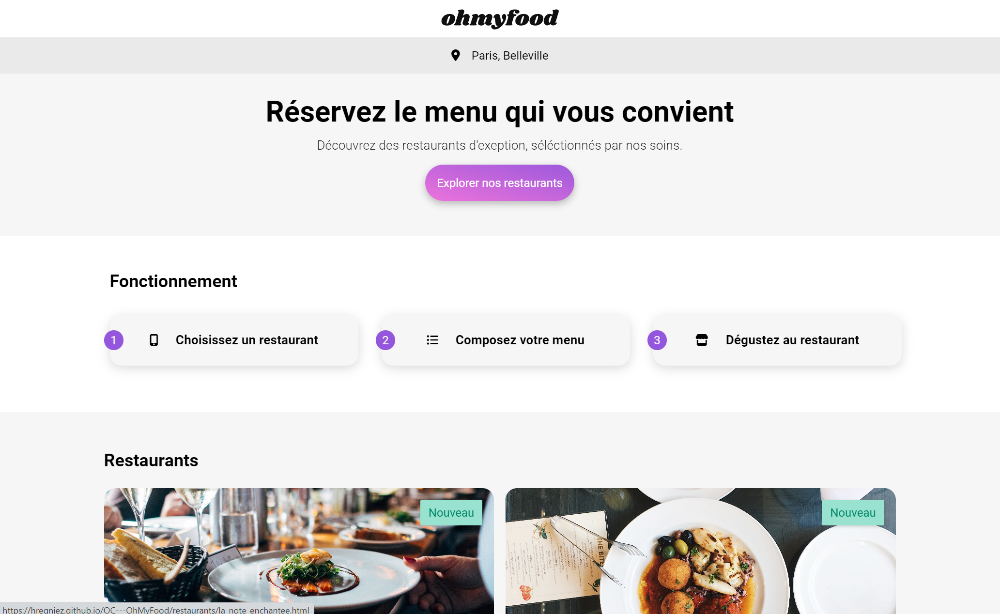

# OpenClassroms - intégrateur web - projet 4 : OhMyFood

Gourmet restaurants web app coded using HTML ans SASS. With a paricular focus on making clean CSS animations

## Table of contents

- [Overview](#overview)
  - [The challenge](#the-challenge)
  - [Screenshot](#screenshot)
  - [Links](#links)
- [My process](#my-process)
  - [Built with](#built-with)
- [Author](#author)

## Overview

### The challenge

- Build a multi-page website from a figma template
- Mobile-first
- Create smoth CSS animations

### Screenshot

### Links

- Live Site URL: [Oh My Food](https://hregniez.github.io/OC---OhMyFood/)

## My process

### Built with

- HTML
- SASS to CSS

## Author

- Website - [hregniez](hregniez.com)

